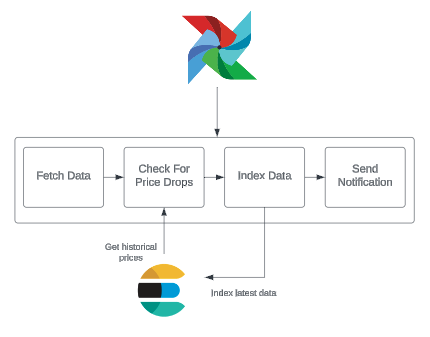

# Flight Price Tracker
An Airflow-powered pipeline that retrieves and processes flight data, indexes it in Elasticsearch, and sends email alerts for price drops.


## Unit Tests
```shell
pip install -r requirements/requirements_dev.txt
pytest tests/unit/test_data_pipeline.py
```
## Dag Validation Tests
```shell
pip install -r requirements/requirements_dev.txt
pytest tests/dag_validations/test_flight_price_tracker_dag.py
```
## Local Environment
Can be used for development and testing purposes.
Deployment configuration is largely based on the official airflow docker compose file. For more info, see https://airflow.apache.org/docs/apache-airflow/stable/howto/docker-compose/index.html

Create .env file in root directory containing:
```bash
ELASTIC_PASSWORD=<define_password_here>
FLIGHT_DATA_API_KEY=<your_api_key_here>
EMAIL_PASSWORD=<your_application_email_app_password>
EMAIL_ADDRESS_FROM=<your_application_email>
EMAIL_ADDRESS_USER=<your_application_email>
EMAIL_RECIPIENT=<email_to_recieve_notifications_here>
```
Deploy containers:
```bash
docker compose up airflow-init
```
Requests can be made to http://localhost:8080/api/v1/dags/flight_price_tracker/dagRuns
e.g.
```python
url = 'http://localhost:8080/api/v1/dags/flight_price_tracker/dagRuns'

data = {
    "conf": {},
    "dag_run_id": "example_run__" + datetime.now().strftime("%Y%m%d%H%M%S"),
}
response = requests.post(url, json=data, auth=('airflow', 'airflow'))
```
## Integration Tests
Set up local environment, described above.

Execute integration tests from host
```bash
docker compose exec airflow-scheduler pytest tests/integration/test_price_tracker_dag.py
```